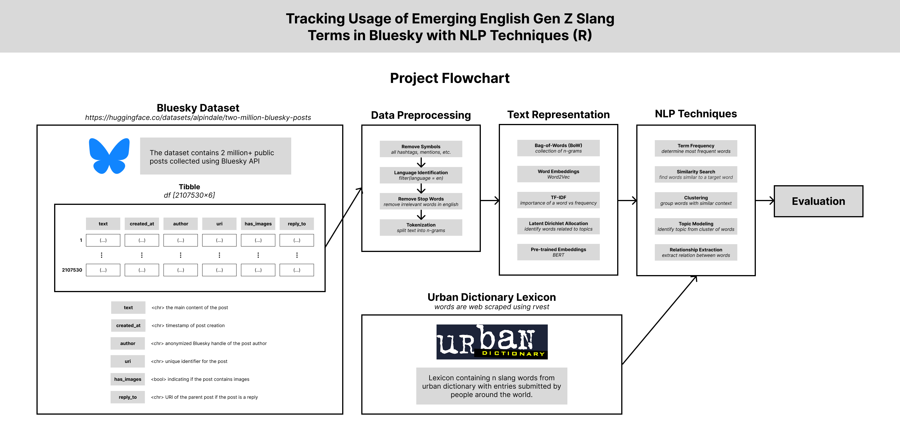

# Introduction



# Methods
```{r setup, include=FALSE}
knitr::opts_knit$set(echo = TRUE, output.dir = "docs")
```

```{r, warning=FALSE}
library(tidyverse)
library(reticulate)
library(cld2)
library(tidytext)
library(wordcloud)
library(tensorflow)
library(keras)
library(word2vec)
library(text2vec)
library(Rtsne)
library(plotly)
library(reshape2)
library(topicmodels)
library(igraph)
library(ggraph)
library(quanteda)
library(rvest)
library(hunspell)
library(textTinyR)
```

## Import Data

### Bluesky Dataset

```{r}
# Import the Python datasets library
datasets <- import("datasets")

# Load the dataset
data <- datasets$load_dataset("alpindale/two-million-bluesky-posts")

# Convert the dataset to a Pandas DataFrame
data <- py_to_r(data$train$to_pandas())

# Sample only a portion of the data (e.g., 10,000 rows)
# set.seed(123)  # For reproducibility
# data <- data %>% sample_n(10000)

# Convert to tibble for tidyverse
data <- as_tibble(data)

# View first few rows
head(data)
```
### Urban Dictionary Lexicon

```{r}
# Set the base URL for Urban Dictionary
base_url <- "https://www.urbandictionary.com/?page="

# Function to scrape words from a specific page
scrape_trending_words <- function(page_num) {
  # Construct the URL for the specific page
  url <- paste0(base_url, page_num)
  
  # Read the webpage HTML
  webpage <- read_html(url)
  
  # Scrape the trending words (target the correct HTML nodes)
  words <- webpage %>%
    html_nodes(".word") %>%
    html_text()
  
  return(words)
}

# Scrape multiple pages
scrape_multiple_pages <- function(num_pages) {
  all_words <- c()
  
  for (i in 1:num_pages) {
    # Scrape words from the i-th page
    words <- scrape_trending_words(i)
    
    # Append the words to the list
    all_words <- c(all_words, words)
  }
  
  return(all_words)
}
```

```{r}
# Scrape the first 100 pages
all_trending_words <- scrape_multiple_pages(100)

# Display the first 10 words
head(all_trending_words, 10)
```

## Data Preprocessing
### Date and Time

```{r}
data <- data %>%
  mutate(
    created_at = ymd_hms(created_at),  # Convert to datetime format
    date = as.Date(created_at),        # Extract date
    time = format(created_at, "%H:%M:%S") # Extract time
  )
head(data)
```

### Removing Symbols

```{r}
data <- data %>%
  mutate(
    text = str_replace_all(text, "http[s]?://\\S+", ""),   # Remove URLs
    text = str_replace_all(text, "@\\w+", ""),             # Remove mentions
    text = str_replace_all(text, "#\\w+", ""),             # Remove hashtags
    text = str_replace_all(text, "[^\x01-\x7F]", ""),      # Remove all non-ASCII characters (including emojis)
    text = str_replace_all(text, "[[:punct:]]", ""),        # Remove punctuation
    text = str_replace_all(text, "\\d+", "")               # Remove numbers
  )
head(data)
```

### Identifying Language

```{r}
# Detect language and add to a column
# Only show english
data <- data %>%
  mutate(language = cld2::detect_language(text)) %>%
  filter(language == "en")

head(data)
```

### Removing Stop Words
```{r}
# Load stop words and convert to lowercase
data("stop_words")
stop_words <- tolower(stop_words$word)

# Remove apostrophes from stop words and create a new list with both forms
expanded_stop_words <- stop_words %>%
  str_replace_all("'", "") %>%  # Remove apostrophes
  unique()  # Get unique words

# Add the original stop words with apostrophes back to the list
expanded_stop_words <- unique(c(expanded_stop_words, stop_words))

# View the expanded stop words list
head(expanded_stop_words)
```

### Tokenizing as a Unigram
```{r}
# Tokenize text
data_unigram <- data %>%
  unnest_tokens(word, text)

# Remove stop words and their misspellings
data_unigram <- data_unigram %>%
  filter(!word %in% expanded_stop_words) %>%
  filter(hunspell_check(word))  # Ensure valid words

# View results
head(data_unigram, 100)
```
### Tokenizing as a Bigram

```{r}
# Load stop words and convert to lowercase
data("stop_words")
stop_words_list <- tolower(stop_words$word)

# Tokenizing into bigrams
data_bigram <- data %>%
  unnest_tokens(bigram, text, token = "ngrams", n = 2)  # Tokenize into bigrams

# Separate bigram into two columns
data_bigram <- data_bigram %>%
  separate(bigram, into = c("word1", "word2"), sep = " ", remove = FALSE)  # Keep original bigram column

# Remove stop words (including misspellings) from bigrams
data_bigram <- data_bigram %>%
  filter(!word1 %in% stop_words_list,
         !word2 %in% stop_words_list,
         hunspell_check(word1),
         hunspell_check(word2))

# View the first few rows
head(data_bigram)
```

## Text Representation
### Bag-of-Words

```{r}
# Create a Bag-of-Words representation for unigrams
bag_of_words_unigram <- data_unigram %>%
  count(word, sort = TRUE)  # Count word frequencies

# View the top 10 most frequent words
head(bag_of_words_unigram, 10)
```
```{r}
# Create a Bag-of-Words representation for bigrams
bag_of_words_bigram <- data_bigram %>%
  count(word1, word2, sort = TRUE)  # Count word frequencies

# View the top 10 most frequent words
head(bag_of_words_bigram, 10)
```
```{r}
bigram_graph <- bag_of_words_bigram %>% 
  filter(n > 20) %>% 
  graph_from_data_frame()
bigram_graph

set.seed(2016)

a <- grid::arrow(type = "closed", length = unit(.15, "inches"))

ggraph(bigram_graph, layout = "fr") +
  geom_edge_link(aes(edge_alpha = n), show.legend = FALSE,
                 arrow = a, end_cap = circle(.07, 'inches')) +
  geom_node_point(color = "lightblue", size = 3) +
  geom_node_text(aes(label = name), vjust = 1, hjust = 1) +
  theme_void()
```

### Word Embeddings (Word2Vec)

```{r}

```

### TF-IDF

```{r}

```

### Latent Dirichlet Allocation

```{r}
t
```

### Pre-trained Embeddings (BERT)

```{r}

```

## NLP Techniques

Definition: An emerging slang word is a word commonly arising from niche sub-cultures that is eventually adopted by the general public and is not listed in the English dictionary (Ex. rizz, skibidi, gyat).

### Term Frequency

```{r}

```

Question: What are the most common emerging slang words used in Bluesky?

### Similarity Search

```{r}

```

Question: What words are synonymous to an emerging slang word?

### Clustering

```{r}

```

Question: What words are commonly used in conjuction to an emerging slang word?

### Topic Modeling

```{r}

```

Question: What context or topic is an emerging slang word used for?

### Relationship Extraction

```{r}

```

Question: What words will most likely appear in a sequence to an emerging slang word? (bi-grams)

# Evaluation

```{r}

```

# Results

```{r}

```
