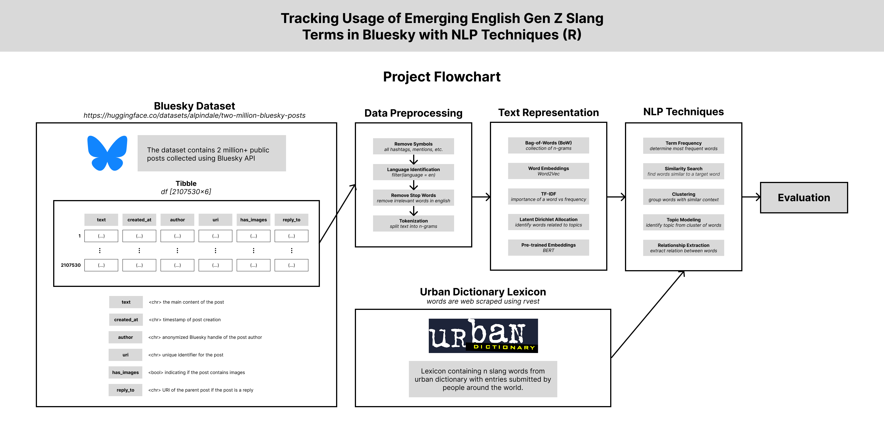

# Introduction

 \# Methods

```{r setup, include=FALSE}
knitr::opts_knit$set(echo = TRUE, output.dir = "docs")
```

```{r, warning=FALSE}
library(tidyverse)
library(reticulate)
library(cld2)
library(tidytext)
library(wordcloud)
library(tensorflow)
library(keras)
library(word2vec)
library(text2vec)
library(Rtsne)
library(plotly)
library(reshape2)
library(topicmodels)
library(igraph)
library(ggraph)
library(quanteda)
library(rvest)
```

## Import Data

### Bluesky Dataset

```{r}
# Import the Python datasets library
datasets <- import("datasets")

# Load the dataset
data <- datasets$load_dataset("alpindale/two-million-bluesky-posts")

# Convert the dataset to a Pandas DataFrame
df <- py_to_r(data$train$to_pandas())

# Check a few rows
head(df)
```

```{r}
# Turn the DataFrame into a tibble for tidyverse
tb <- as_tibble(df)

# View the first few rows
tail(tb)
```

### Urban Dictionary Lexicon

```{r}
# Set the base URL for Urban Dictionary
base_url <- "https://www.urbandictionary.com/?page="

# Function to scrape words from a specific page
scrape_trending_words <- function(page_num) {
  # Construct the URL for the specific page
  url <- paste0(base_url, page_num)
  
  # Read the webpage HTML
  webpage <- read_html(url)
  
  # Scrape the trending words (target the correct HTML nodes)
  words <- webpage %>%
    html_nodes(".word") %>%
    html_text()
  
  return(words)
}

# Scrape multiple pages
scrape_multiple_pages <- function(num_pages) {
  all_words <- c()
  
  for (i in 1:num_pages) {
    # Scrape words from the i-th page
    words <- scrape_trending_words(i)
    
    # Append the words to the list
    all_words <- c(all_words, words)
  }
  
  return(all_words)
}
```

```{r}
# Scrape the first 10 pages
all_trending_words <- scrape_multiple_pages(100)

# Display the first 10 words
head(all_trending_words, 10)
```

## Data Preprocessing

### Removing Symbols

```{r}
tb <- tb %>%
  mutate(
    text = str_replace_all(text, "http[s]?://\\S+", ""),   # Remove URLs
    text = str_replace_all(text, "@\\w+", ""),             # Remove mentions
    text = str_replace_all(text, "#\\w+", ""),             # Remove hashtags
    text = str_replace_all(text, "[^\x01-\x7F]", ""),      # Remove all non-ASCII characters (including emojis)
    text = str_replace_all(text, "[[:punct:]]", "")        # Remove punctuation
  )

```

### Identifying Language

```{r}
# Detect language and add to a column
tb <- tb %>%
  mutate(language = cld2::detect_language(text)) %>%
  filter(language == "en")

head(tb)
```

### Removing Stop Words

### Tokenization

## Text Representation

### Bag-of-Words

### Word Embeddings (Word2Vec)

### TF-IDF

### Latent Dirichlet Allocation

### Pre-trained Embeddings (BERT)

## NLP Techniques

Definition: An emerging slang word is a word commonly arising from niche sub-cultures that is eventually adopted by the general public and is not listed in the English dictionary (Ex. rizz, skibidi, gyat).

### Term Frequency

Question: What are the most common emerging slang words used in Bluesky?

### Similarity Search

Question: What words are synonymous to an emerging slang word?

### Clustering

Question: What words are commonly used in conjuction to an emerging slang word?

### Topic Modeling

Question: What context or topic is an emerging slang word used for?

### Relationship Extraction

Question: What words will most likely appear in a sequence to an emerging slang word? (bi-grams)

# Evaluation

# Results
